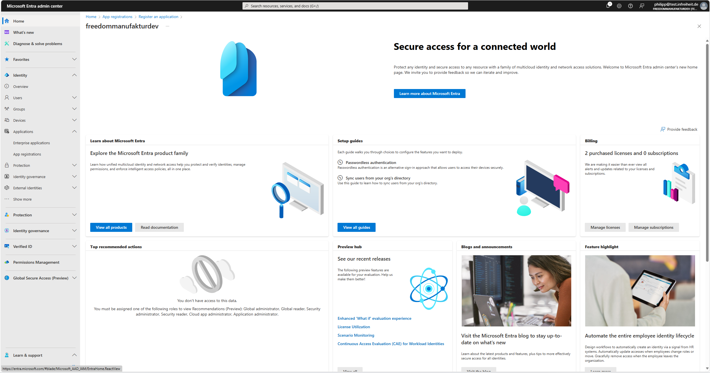
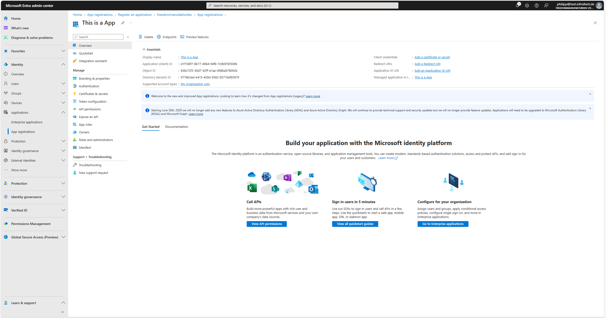

# Register an application in Microsoft Entra

## Step 1 
- Open the [`Microsoft Entra admin center`](https://entra.microsoft.com/#home) and log in with your credentials
  

## Step 2
- Now click on `Applications` on the left side
- Click on `App registrations`
  

## Step 3
- Click on `+ New registration`
- Choose the `Name` of the application you want to register
- Choose `Accounts in this organizational directory only (freedommanufakturdev only - Single tenant)` as the `Supported account types`
- `Redirect URI` is optional and not needed 
  

## Step 4 
- Click on `Save` to register your application
- After saving you will be redirected to the `Overview` of your registered application
  

## Step 5 
- Click on `API permissions`
- Click on `+ Add a permission`
- The list of API's will be displayed for you to choose your permissions
  

## Step 6 
- Click on `Microsoft Graph`
- Click on `Delegated permissions`
- Choose your desired permissions you want to register for your application
- Click on `Add permissions` to save your changes
  

## Step 7 
- Click on `Authentication`
- Under `Advanced settings` turn on `Enable the following mobile and desktop flows`
  

## Step 8 
- Click on `Certificates & secrets`
- Click on `+ New client secret`
- Choose the `Description` for the client secret and when it `Expires`
- Click on `Add` to save your changes
  

## Step 9
- Copy and save the `Value` of the secret key
  

Now you have registered an application with all required informations.

