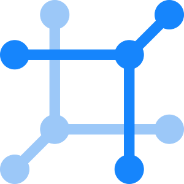

List of whoosh Oktopus actions
===
Version: `6.9.0` - `2025-12-10` \
Link: [Documentation on GitHub](https://github.com/freedom-manufaktur/Oktopus/blob/main/Documentation/Oktopus%20Actions.md)

# Technologies
- [Active Directory](#-active-Directory)
- [Azure DevOps](#-azure-devops)
- [CSV](#-csv)
- [Debug](#-debug)
- [DocuSign](#-docusign)
- [Exchange Server](#-exchange-server)
- [File compression](#-file-compression)
- [File System](#-file-system)
- [Google Admin Console](#-google-admin-console)
- [Google Drive](#-google-drive)
- [HTTP](#-http)
- [IGEL Technology](#-igel-technology)
- [Image](#-image)
- [IMAP](#-imap)
- [Ivanti Neurons for ITSM / Ivanti Service Manager (ISM)](#-ivanti-neurons-for-itsm--ivanti-service-manager-ism)
- [Jira](#-jira)
- [JSON](#-json)
- [LeanIX](#-leanix)
- [LexOffice](#-lexoffice)
- [Mail](#-mail)
- [Microsoft 365](#-microsoft-365)
- [Microsoft 365 Contacts](#-microsoft-365-contacts)
- [Microsoft Excel](#-microsoft-excel)
- [Microsoft OneDrive / SharePoint](#-microsoft-onedrive--sharepoint)
- [Microsoft SQL Server](#-microsoft-sql-server)
- [Microsoft Teams](#-microsoft-teams)
- [Microsoft Word](#-microsoft-word)
- [NetBox](#-netbox)
- [Ninox](#-ninox)
- [Oktopus](#-oktopus)
- [PDF](#-pdf)
- [Power BI](#-power-bi)
- [RayVentory Data Hub](#-rayventory-data-hub)
- [ServiceNow](#-servicenow)
- [Shopware](#-shopware)
- [SMAX](#-smax)
- [Text](#-text)
- [Timer](#-timer)
- [Timewax](#-timewax)
- [USU Service Manager (USM)](#-usu-service-manager-usm)
- [Webhook](#-webhook)

##  Active Directory
### Actions
- [Add a principal to groups](#add-a-principal-to-groups)
- [Create User](#create-user)
- [Delete principal](#delete-principal)
- [Find User](#find-user)
- [Remove a principal from groups](#remove-a-principal-from-groups)
- [Reset user password](#reset-user-password)
- [Update User](#update-user)

#### Add a principal to groups
Add a User, Group or Computer to any number of groups.

#### Create User
Create a new user account

#### Delete principal
Delete a User, Group or Computer.

#### Find User
Finds a user by name.

#### Remove a principal from groups
Remove a User, Group or Computer from any number of groups.

#### Reset user password
Resets a users password.

#### Update User
Update a User with a selection of properties.

[🔝 Back to top](#technologies)

##  Azure DevOps
### Actions
- [Add attachments to Work Item](#add-attachments-to-work-item)
- [Create Work Item](#create-work-item)
- [Delete build(s)](#delete-builds)
- [Get Work Item](#get-work-item)
- [List builds](#list-builds)
- [Update Work Item](#update-work-item)
- [Users: Add User](#users-add-user)
- [Users: List Users](#users-list-users)
- [Users: Remove User](#users-remove-user)

#### Add attachments to Work Item
Adds any number of attachments to a Work Item.

#### Create Work Item
Create a new work item.

#### Delete build(s)
Delete one or more builds by ID.

#### Get Work Item
Get work item by ID.

#### List builds
List all builds.

#### Update Work Item
Update a work item.

#### Users: Add User
Adds a user to an organization.

#### Users: List Users
Lists all users in an organization.

#### Users: Remove User
Removes a user from an organization.

[🔝 Back to top](#technologies)

##  CSV
### Actions
- [Parse CSV](#parse-csv)

#### Parse CSV
Parses the given CSV and stores the resulting data.
##### Ideas
- After downloading an attachment from a ticket, parse the CSV file and process the data.
- After reading a file from a network share (exported by a software), parse the CSV file and process the data (e.g. upsert to a CMDB).

[🔝 Back to top](#technologies)

##  Debug
### Actions
- [Print Expression](#print-expression)

#### Print Expression
Prints the expression to the log file.

[🔝 Back to top](#technologies)

##  DocuSign
### Actions
- [Get envelope](#get-envelope)
- [Get envelope audit events](#get-envelope-audit-events)
- [Sign Document](#sign-document)

#### Get envelope
Get information about a document signing request (envelope).

#### Get envelope audit events
Get the audit events of a document signing request (envelope).

#### Sign Document
Notify People about a document signing request.

[🔝 Back to top](#technologies)

##  Exchange Server
### Actions
- [Cancel Meeting](#cancel-meeting)
- [Create Meeting](#create-meeting)
- [Delete item](#delete-item)
- [Mark email as read](#mark-email-as-read)
- [Move item](#move-item)
- [Send Email](#send-email)
- [Update Meeting](#update-meeting)

#### Cancel Meeting
Cancel an existing meeting.

#### Create Meeting
Send a meeting invitation.

#### Delete item
Deletes an item (mail, appointment, meeting).

#### Mark email as read
Marks an email as read.

#### Move item
Moves an item (mail, appointment, meeting) to a different folder.

#### Send Email
Sends an email.

#### Update Meeting
Update an existing meeting.

[🔝 Back to top](#technologies)

##  File compression
### Actions
- [Create archive](#create-archive)

#### Create archive
Creates an archive file (typically .zip).

[🔝 Back to top](#technologies)

##  File System
### Actions
- [Copy file](#copy-file)
- [Delete file](#delete-file)
- [Move file](#move-file)
- [Read file](#read-file)
- [Save file](#save-file)

#### Copy file
Copies a file from one location to another.

#### Delete file
Delete a file.

#### Move file
Moves a file from one location to another.

#### Read file
Reads the content of a file to a variable.

#### Save file
Writes the given file variable or data to a file.

[🔝 Back to top](#technologies)

##  Google Admin Console
### Actions
- [Get a User](#google-admin---get-a-user)

#### Get a User
Gets the information about a user.

[🔝 Back to top](#technologies)

##  Google Drive
### Actions
- [Get drive](#google-drive---get-drive)
- [Find drives](#google-drive---find-drives)
- [Get file](#google-drive---get-file)
- [Find files/folders](#google-drive---find-filesfolders)
- [Download file](#google-drive---download-file)
- [Upload file](#google-drive---upload-file)

#### Get drive
Gets a drive by name.

#### Find drives
Finds all drives by query.

#### Get file
Gets a file by name.

#### Find files/folders
Finds all files and folders by query.

#### Download file
Download a file (from a shared drive).
##### Ideas
- Download a template for a [Word - Mail Merge](#mail-merge) or an [Excel - Data import](#excel---data-import).
- Download images to use as a signature in an email.

#### Upload file
Upload a file (to a shared drive).
##### Ideas
- After performing a [Word - Mail Merge](#mail-merge) upload the created document (e.g. invoice) to a Google Drive for archival.
- Export some data from your CRM (maybe regularly) and store it in a drive for easy access.

[🔝 Back to top](#technologies)

##  HTTP
### Actions
- [Send HTTP request](#send-http-request)
- [Send HTTP request (preview)](#send-http-request-preview)

#### Send HTTP request
Call any HTTP endpoint.

#### Send HTTP request (preview)
Call any HTTP endpoint multiple times.\
Note: This is a preview step, wich is not production ready and may change in the future.

[🔝 Back to top](#technologies)

##  IGEL Technology
### Actions
- [Get firmwares](#get-firmwares)
- [Get thin clients](#get-thin-clients)

#### Get firmwares
Get all firmwares.

#### Get thin clients
Get all thin clients.

[🔝 Back to top](#technologies)

##  Image

### Actions
- [Convert image](#convert-image)

#### Convert image
Converts a number of images to a target format.

[🔝 Back to top](#technologies)

##  IMAP
### Actions
- [Delete mail](#delete-mail)
- [Move mail](#move-mail)

#### Delete mail
Delete an email.

#### Move mail
Move an email to a different folder.

[🔝 Back to top](#technologies)

##  Ivanti Neurons for ITSM / Ivanti Service Manager (ISM)
### Actions
- [Add attachment](#add-attachment)
- [Add attachments](#add-attachments)
- [Create Business Object](#create-business-object)
- [Create Service Request](#create-service-request)
- [Create or update Business Obejct(s)](#create-or-update-business-obejcts)
- [Delete Busines Object](#delete-busines-object)
- [Find Business Objects (by field)](#find-business-objects-by-field)
- [Find Business Objects (by query)](#find-business-objects-by-query)
- [Find Business Objects (by relation)](#find-business-objects-by-relation)
- [Find Employees](#find-employees)
- [Get attachment](#get-attachment)
- [Get Business Object (by field)](#get-business-object-by-field)
- [Get Business Object (by query)](#get-business-object-by-query)
- [Get Business Object (by field values)](#get-business-object-by-field-values)
- [Get request offering](#get-request-offering)
- [Update Business Object](#update-business-object)

#### Add attachment
Adds an attachment to a specific Business Object.
##### Ideas
- Another ticket system (e.g. Jira) has a new attachment, which should now be added to a Business Object.

#### Add attachments
Adds multiple (0-n) attachments to a specific Business Object.
##### Ideas
- A mail-in workflow creates a `Journal.Email` object and adds the attachments to it.
- Another ticket system (e.g. Jira) already has a bunch of attachments, that should be uploaded all at once.

#### Create Business Object
Creates a new Business Object (any kind of object).

#### Create Service Request
Creates a new Service Request based on a Request Offering.
##### Ideas
- A mail-in workflow creates a new service request based on that email (or attaches the email to an existing Business Object).
- Create service requests on a regular basis for recurring tasks.
- A 3rd party system wants to create service requests.

#### Create or update Business Obejct(s)
Create or update (upsert) a Single Business Object or many at once.

#### Delete Busines Object
Deletes a Business Object.

#### Find Business Objects (by field)
Finds Business Objects with a specific field value.

#### Find Business Objects (by query)
Finds Business Objects with a combination of conditions.

#### Find Business Objects (by relation)
Finds Business Objects related to a specific object.
##### Ideas
- After getting a specific Business Object, get all affected *CIs* or responsible *Employees*.

#### Find Employees
Finds employee objects (Employee#) by ID. This is a handy shortcut when transforming LoginlD to ReclD or ice versa.

#### Get attachment
Gets an attachment Object and downloads the content.

#### Get Business Object (by field)
Gets the oldest Business Object with a specific field value.

#### Get Business Object (by query)
Gets the oldest Business Object with a combination of conditions.

#### Get Business Object (by field values)
Gets the oldest Business Objects for each specific field value.

#### Get request offering
Get the request data - including parameters - associated with a service request (ServiceReq).

#### Update Business Object
Updates a Business Object.

[🔝 Back to top](#technologies)

##  Jira
### Actions
- [Add Attachment](#jira---add-attachment)
- [Add Comment](#jira---add-comment)
- [Add web link](#jira---add-web-link)
- [Create Issue](#jira---create-issue)
- [Delete Issue](#jira---delete-issue)
- [Do Transition](#jira---do-transition)
- [Find Issue (JQL)](#jira---find-issue-jql)
- [Find User](#jira---find-user)
- [Get Attachment](#jira---get-attachment)
- [Get Issue](#jira---get-issue)
- [Get Issues](#jira---get-issues)
- [Get Project Roles](#jira---get-project-roles)
- [Set Project Role users](#jira---set-project-role-users)
- [Trigger issue updated](#jira---trigger-issue-updated)
- [Update Comment](#jira---update-comment)
- [Update Issue](#jira---update-issue)

#### Add Attachment
Adds a new attachment to an issue.

#### Add Comment
Adds a new comment to an issue.

#### Add web link
Adds a new link to a specified URL.

#### Create Issue
Creates a new issue.

#### Delete Issue
Deletes an existing issue.

#### Do Transition
Transition an issue from one State to the next. Also allows multiple transitions at once.

#### Find Issue (JQL)
Get the first issue that matches the specified Jira query (JQL).

#### Find User
Finds a user by ID, email or name.

#### Get Attachment
Get a specific attachment.

#### Get Issue
Get a specific issue.

#### Get Issues
Get specific issues.

#### Get Project Roles
Gets all available project roles and their users.

#### Set Project Role users
Replaces all assigned users and groups with a new set of users/groups.

#### Trigger issue updated
Triggers an Oktopus workflow with 'Issue created/updated (Webhook) trigger.

#### Update Comment
Updates an existing comment.

#### Update Issue
Updates an existing issue.

[🔝 Back to top](#technologies)

##  JSON
### Actions
- [Parse JSON](#parse-json)

#### Parse JSON
Parses the given JSON and stores the resulting data.
##### Ideas
- After downloading an attachment from a ticket, parse the JSON file and process the data.
- After reading a file from a network share (exported by a software), parse the JSON file and process the data (e.g. upsert to a CMDB).

[🔝 Back to top](#technologies)

##  LeanIX
### Actions
- [Get fact sheets](#get-fact-sheets)
- [Get metadata (language)](#get-metadata-language)
- [GraphQL query](#graphql-query)

#### Get fact sheets
Gets all fact sheets. You may choose specific types like 'Applicationl.

#### Get metadata (language)
Gets the metadata (e.g. about fact sheets) for a specific language. This is handy to translate field values.

#### GraphQL query
Executes an arbitrary query with any result.

[🔝 Back to top](#technologies)

##  Lexoffice
### Actions
- [Create company](#lexware---create-company)
- [Create person](#lexware---create-person)
- [Create invoice](#lexware---create-invoice)
- [Create quotation](#lexware---create-quotation)
- [Get contact](#lexware---get-contact)
- [Get invoice](#lexware---get-invoice)
- [Get quotation](#lexware---get-quotation)

#### Create company
Create a company contact.

#### Create person
Create a person contact.

#### Create invoice
Create an invoice.

#### Create quotation
Create a quotation.

#### Get contact
Get information about a person or company.

#### Get invoice
Get information about an invoice.

#### Get quotation
Get information about a quotation.

[🔝 Back to top](#technologies)

##  Mail
### Actions
- [Parse EML](#parse-eml)

#### Parse EML
Parses an EML file into its individual parts.
##### Ideas
- A 3rd party system has captured an email as EML file and you want to extract the individual information, like body (HTML) and attachments.
- You want to convert the HTML body (by default without images) to HTML that has the images inlined and can be stored in a HTML compatible field.

[🔝 Back to top](#technologies)

##  Microsoft 365
### Actions
- [Delete mail](#microsoft365---delete-mail)
- [Move mail](#microsoft365---move-mail)
- [Send mail](#microsoft365---send-mail)

### Entra ID App
[How to register an App within Microsoft Entra ID](Register%20an%20App%20within%20Entra%20ID.md)

#### Delete mail
Delete an email.

#### Move mail
Move an email to a different folder.

#### Send mail
Send a mail.

[🔝 Back to top](#technologies)

##  Microsoft 365 Contacts
### Actions
- [Create contact](#create-contact)
- [Create or update (upsert) contacts](#create-or-update-upsert-contacts)
- [Get contact](#get-contact)
- [Get contact folders](#get-contact-folders)
- [Update contact](#update-contact)

#### Create contact
Create contact for the current or a specific user.

#### Create or update (upsert) contacts
Create or update (upsert) multiple contacts of the current or specific users.

#### Get contact
Get contact for the current or a specific user.

#### Get contact folders
Get all contact folders for the current or a specific user.

#### Update contact
Update a contact of the current or a specific user.

[🔝 Back to top](#technologies)

##  Microsoft Excel
### Actions
- [Data export](#excel---data-export)
- [Data import](#excel---data-import)

#### Data export
Take an Excel file and export all of the rows and columns from a sheet.
##### Ideas
- You may then convert the data to `CSV` or `JSON` and upload it somewhere.
- You may iterate over the list and upsert specific or all rows and columns to a Ticket system.
- Import data from services without an API, but with an Excel export.

#### Data import
Take an Excel template and import any amount of rows and columns into the speadsheet.
##### Ideas
- Make use of formulas to do advanced calculations or charting on the imported data.
- Highlight certain columns for your customers to fill out. E.g. B2B shopping list.
- After filling the template with your data, send it directly to your customer or upload it to any other service.

[🔝 Back to top](#technologies)

##  Microsoft OneDrive / SharePoint
### Actions
- [Delete file](#onedrive---delete-file)
- [Download file](#onedrive---download-file)
- [Upload file](#onedrive---upload-file)

#### Delete file
Deletes a file from OneDrive.

#### Download file
Downloads a file from OneDrive.

#### Upload file
Uploads a file to OneDrive.

[🔝 Back to top](#technologies)

##  Microsoft SQL Server
### Actions
- [Query](#query)

#### Query
Executes a user specified query.

[🔝 Back to top](#technologies)

##  Microsoft Teams
### Actions
- [Create Team](#create-team)
- [Get 1:1 chat](#get-11-chat)
- [Get channel messages](#get-channel-messages)
- [Get chat messages](#get-chat-messages)
- [Get User](#get-user)
- [Send channel message](#send-channel-message)
- [Send chat message](#send-chat-message)

#### Create Team
Creates a team (including the Microsoft 365 Group).
[How to register an App within Microsoft Entra ID](Register%20an%20App%20within%20Entra%20ID.md)

#### Get 1:1 chat
Starts or resumes a chat from the service account with another person.

#### Get channel messages
Gets the most recent 50 messages in a channel.

#### Get chat messages
Gets the most recent 50 messages in a Chat.

#### Get User
Gets the information about a certain user.

#### Send channel message
Sends a message to a channel inside a team.

#### Send chat message
Sends a message to a Chat.

[🔝 Back to top](#technologies)

##  Microsoft Word
### Actions
- [Convert documents to PDF](#convert-documents-to-pdf)
- [Convert to PDF](#convert-to-pdf)
- [Mail Merge](#mail-merge)
- [Modify document](#modify-document)

#### Convert documents to PDF
Convert multiple documents to PDF.

#### Convert to PDF
Convert a single documents to PDF.

#### Mail Merge
Fill a document that contains placeholders (`MERGEFIELD`) with an actual value.
##### Ideas
- Use the information of an order and create an invoice document.
- Create a template for multiple geographical regions and remove certain paragraphs based an the customer region. 

#### Modify document
Modify a document by removing certain paragraphs.

[🔝 Back to top](#technologies)

##  NetBox
### Actions
- [Get devices](#get-devices)
- [Get IP prefixes](#get-ip-prefixes)
- [Get sites](#get-sites)
- [Get support contracts](#get-support-contracts)
- [Get tenants](#get-tenants)
- [Get virtual machines](#get-virtual-machines)
- [Get VLANs](#get-vlans)

#### Get devices
Get all devices.

#### Get IP prefixes
Get all IP prefixes.

#### Get sites
Get all Sites.

#### Get support contracts
Get all support contracts. This requires a NetBox plugin.

#### Get tenants
Get all tenants.

#### Get virtual machines
Get all virtual machines.

#### Get VLANs
Get all VLANs.

[🔝 Back to top](#technologies)

##  Ninox
### Actions
- [Create or update record(s)](#create-or-update-records)
- [Create record](#create-record)
- [Delete attachment](#delete-attachment)
- [Delete record](#delete-record)
- [Download attechment](#download-attechment)
- [Download attechments](#download-attechments)
- [Download various attechments](#download-various-attechments)
- [Find record](#find-record)
- [Find records](#find-records)
- [Get record](#get-record)
- [Get records](#get-records)
- [Update record](#update-record)
- [Update attachment](#update-attachment)
- [Update attachments](#update-attachments)

### Help
In following link u have information about the filters in get requests.
https://docs.ninox.com/en/api/introduction/tables-fields-records

#### Create or update record(s)
Create or update (upsert) a Single record or many at once.

#### Create record
Create a new record within a table.

#### Delete attachment
Deletes a specific attachment from a record.

#### Delete record
Delete a record.

#### Download attechment
Downloads a specific attachment from a record.

#### Download attechments
Downloads all attachments from a record.

#### Download various attechments
Downloads specific attachments from specific records.

#### Find record
Finds a specific record within a table.

#### Find records
Finds records within a table.

#### Get record
Gets a specific record by ID.

#### Get records
Gets specific records by ID.

#### Update record
Update certain fields of a record.

#### Update attachment
Uploads an attachment to a record.

#### Update attachments
Uploads attachments to a record.

[🔝 Back to top](#technologies)

##  Oktopus
### Actions
- [Evaluate script](#evaluate-script)

#### Evaluate script
Evaluate a more or less comples script which generates variables or influences the workflow state.

[🔝 Back to top](#technologies)

##  PDF
### Actions
- [Merge PDFs](#merge-pdfs)

#### Merge PDFs
Merge multiple PDF files into one PDF file.

[🔝 Back to top](#technologies)

##  Power BI
### Actions
- [Add rows to push dataset](#add-rows-to-push-dataset)
- [Create push dataset](#create-push-dataset)
- [Delete rows from push dataset](#delete-rows-from-push-dataset)
- [Execute Data Analysis Expression](#execute-data-analysis-expression)
- [Get dataset](#get-dataset)
- [Get datasets](#get-datasets)
- [Get push dataset tables](#get-push-dataset-tables)
- [Refresh dataset](#refresh-dataset)

#### Add rows to push dataset
Adds any number of new rows to a push dataset.

#### Create push dataset
Creates a new push dataset.

#### Delete rows from push dataset
Deletes all rows from a pusgh dataset.

#### Execute Data Analysis Expression
Executes a Data Analysis Expression (DAX).

#### Get dataset
Gets a specific dataset.

#### Get datasets
Gets all available datasets (available to the connection account).

#### Get push dataset tables
Gets all tables inside a oush dataset. Push dataset are very limited in ther functionality.

#### Refresh dataset
Refreshes a dataset.

[🔝 Back to top](#technologies)

##  RayVentory Data Hub
### Actions
- [Get table data](#get-table-data)

#### Get table data
Gets all rows from table.

[🔝 Back to top](#technologies)

##  ServiceNow
### Actions
- [Create record](#servicenow---create-record)
- [Delete record](#servicenow---delete-record)
- [Find records](#servicenow---find-records)
- [Update record](#servicenow---update-record)

#### Create record
Create a record.

#### Delete record
Delete a record.

#### Find records
Finds records based on a query.

#### Update Record
Update a record.

[🔝 Back to top](#technologies)

##  Shopware
### Actions
- [Create product](#create-product)
- [Create product cross selling](#create-product-cross-selling)
- [Delete product](#delete-product)
- [Delete product cross selling](#delete-product-cross-selling)
- [Get product](#get-product)
- [Get product cross selling](#get-product-cross-selling)
- [Translate categories](#translate-categories)
- [Translate product](#translate-product)
- [Update product](#update-product)
- [Update product cross selling](#update-product-cross-selling)

#### Create product
Creates products in your shop.

#### Create product cross selling
Adds new cross selling to specific product.

#### Delete product
Deletes specific product from the shop.

#### Delete product cross selling
Deletes the cross selling entity for a given product.

#### Get product
Get a specific product.

#### Get product cross selling
Gets all cross selling entities of a specific product.

#### Translate categories
Adds translated texts to given categories in the specified language.

#### Translate product
Adds translated texts to a specific product.

#### Update product
Updates a specific product.

#### Update product cross selling
Updates a given cross selling entity of a specific product.

[🔝 Back to top](#technologies)

##  SMAX
### Actions
- [Add comment](#smax---add-comment)
- [Create record](#smax---create-record)
- [Delete comment](#smax---delete-comment)
- [Delete record](#smax---delete-record)
- [Find record](#smax---find-record)
- [Find records](#smax---find-records)
- [Get record](#smax---get-record)
- [Update comment](#smax---update-comment)
- [Update record](#smax---update-record)

#### Add comment
Adds one or more attechments to a record.

#### Create record
Adds a new comment to a record.

#### Delete comment
Deletes anm existing comment.

#### Delete record
Deletes anm existing record.

#### Find record
Find a record by query.

#### Find records
Find records by query.

#### Get record
Get a record by ID.

#### Update comment
Updates an existing comment.

#### Update record
Updates an existing record.

[🔝 Back to top](#technologies)

##  Text
### Actions
- [Create file](#create-file)
- [Create file (from Base64)](#create-file-from-Base64)
- [Create text](#create-text)
- [Generate password](#generate-password)
- [Map single value](#map-single-value)
- [Read file](#read-file)
- [Split text](#split-text)

#### Create file
Combine variables and static text into a file.

#### Create file (from Base64)
Converts Base64 text into a file.

#### Create text
Combine variables and static text into a new text document.

#### Generate password
Generates a random sewuence of characters with a given length and character set.

#### Map single value
Takes any input text, mapped against a table with a specific output selected.

#### Read file
Reads the content of a file variable.

#### Split text
Takes any input text and split it by any given separator.

[🔝 Back to top](#technologies)

##  Timewax
### Actions
- [Add project](#timewax---add-project)
- [Add time entries](#timewax---add-time-entries)
- [Find resources](#timewax---find-resources)
- [Find time entries](#timewax---find-time-entries)
- [Get project](#timewax---get-project)
- [Get projects](#timewax---get-projects)
- [Get resource](#timewax---get-resource)
- [Get time entries](#timewax---get-time-entries)
- [List resources](#timewax---list-resources)

#### Add project
Adds a new project.

#### Add time entries
Add new time entries.

#### Find resources
Find resources by query.

#### Find time entries
Get a list of time entries from multiple resources.

#### Get project
Get a specific project.

#### Get projects
Get a list of projects.

#### Get resource
Get a specific resource.

#### Get time entries
Get a list of time entries given a from and to date.

#### List resources
Get a list of resources.

[🔝 Back to top](#technologies)

##  Timer
### Actions
- [Delay](#delay)

#### Delay
Waits a certain amount of time.\
Enter the time span between each execution (format `h:mm:ss`).

##### Example
`0:2:30` (2.5 minutes)

[🔝 Back to top](#technologies)

##  USU Service Manager (USM)
### Actions
- [Change Object](#change-object)
- [Create Object](#create-object)
- [Create Ticket](#create-ticket)
- [Find Objects](#find-objects)
- [Get Object](#get-object)
- [Get Object by field](#get-object-by-field)

#### Change Object
Changes (updates) an existing Business Object.

#### Create Object
Creates a new Business Object.

#### Create Ticket
Creates a new ticket (Incident, Problem, ...).

#### Find Objects
Finds a specific bbusiness object.

#### Get Object
Fet a specific business object.

#### Get Object by field
Get the first business object by field.

[🔝 Back to top](#technologies)

##  Webhook
### Actions
- [Webhook Response](#webhook-response)

#### Webhook Response
Customize the webhook response sent when immediatly executing a workflow via webhook.\
The response content. This can be a variety of text and variables.

##### Example
JSON: `{{ { Id: Ticket.Id, Messages: [ "Thanks Oktopus" ] } }}`\
File: `{{AFileVariable}}`\
Text: `Hello from my workflow.`\
HTML: `<a href="https://freedom-manufaktur.com">Thanks Oktopus</a>`

[🔝 Back to top](#technologies)
